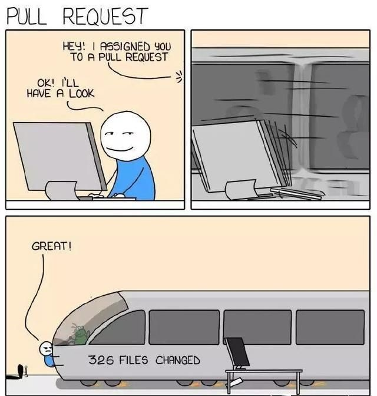

# 代码审核

```text
作者: kiki
日期: 2020/1/7
```

## 动机

- 开发团队内部知识共享：不止一个人熟悉代码
- 维护代码风格和设计的一致性
- 提升代码质量：代码可读性、可维护性、安全性
- 确保足够测试
- 代码历史跟踪

## 概念

- 所有者：树形仓库，私有 -> 公共
- 可读性：代码库内的代码风格和规范的一致性 -> 语言风格指南
- 代码审核流：参考下面的[流程](#流程)

## 轻量

代码审核必须是一个轻量的流程。



- 严格的代码审核标准
- 一个 reviewer
- 少量(11-32 行)、增量修改(除了大量删除和自动化重构)
- 没有无用评论

## 流程

- [ ] 创建：author 修改代码。完成之后创建一个修改
- [ ] 预览：author 使用工具预览修改，查看自动的代码分析(如 Tricorder 等)。完成之后，通知 reviewer
- [ ] 评论：reviewer 在网页界面查看修改，根据需要添加评论
- [ ] 引用反馈：author 查看评论，按需修改代码或回复评论。
- [ ] 批准：所有讨论结束后，reviewer 批准修改，标记为 “LGTM (Look Good To Me)”，然后 commit

也可以提交未完成的修改，以便讨论确定如何完成实现。

## 清单

- [ ] 在写新代码之前，先 review 掉需要评审的代码
- [ ] 检查代码风格和编程规范(可读性 reviewer 1 人)
- [ ] 检查常规的 bad smell 和代码 bug (reviewer)
- [ ] 不要在 review 中讨论需求
- [ ] 更新 checklist

## 准备工作

- [ ] 建立各种编程语言的可读性认证机制
- [ ] 培养合格的 reviewer：从一组“种子” reviewer 开始，让更多同事获得认证成为合格的 reviewers
- [ ] 建立各种语言的代码风格。评注中可以给出建议的出处的 URL，使得保持代码风格和可维护性落到实处
- [ ] 建立 Code Lab 机制。帮助工程师们入门开发流程和规范。
- [ ] 建立 change approval 机制。每个模块一个负责人，先由负责人 review，再提交到主仓库。
- [ ] 明确 issue 能否提交是工程师自己的责任。一个 issue 能否提交是开发人员自己的责任。开发人员自己要积极推动合作人员帮忙 review issue，推动 issue 被通过并及时提交

## 资料

- [Modern Code Review: A Case Study at Google](https://sback.it/publications/icse2018seip.pdf)
- [让 Code Review 成为一种习惯](https://my.oschina.net/niithub/blog/1927106)
