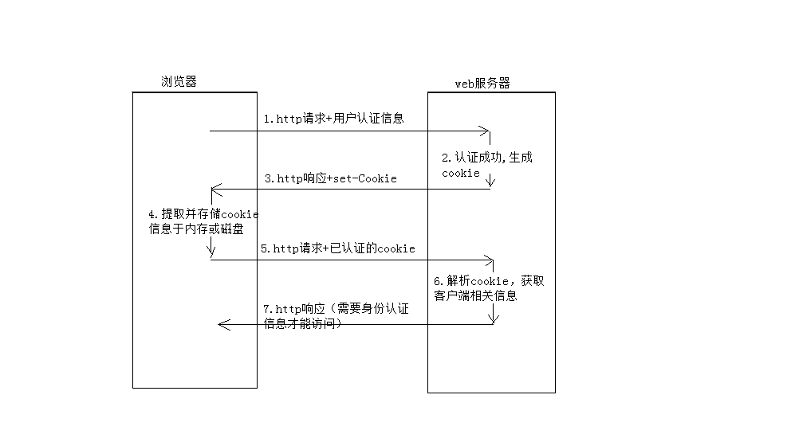

# Cookie

- [Cookie](#cookie)
  - [什么是cookie](#%e4%bb%80%e4%b9%88%e6%98%afcookie)
  - [cookie的机制](#cookie%e7%9a%84%e6%9c%ba%e5%88%b6)
  - [cookie基本属性项](#cookie%e5%9f%ba%e6%9c%ac%e5%b1%9e%e6%80%a7%e9%a1%b9)
  - [Cookie的缺陷](#cookie%e7%9a%84%e7%bc%ba%e9%99%b7)
  - [作者](#%e4%bd%9c%e8%80%85)
  - [声明](#%e5%a3%b0%e6%98%8e)

## 什么是cookie

HTTP协议本身是无状态的。什么是无状态呢，即服务器无法判断用户身份。Cookie实际上是一小段的文本信息（key-value格式）。客户端向服务器发起请求，如果服务器需要记录该用户状态，就使用response向客户端浏览器颁发一个Cookie。客户端浏览器会把Cookie保存起来。当浏览器再请求该网站时，浏览器把请求的网址连同该Cookie一同提交给服务器。服务器检查该Cookie，以此来辨认用户状态。

打个比方，我们去银行办理储蓄业务，第一次给你办了张银行卡，里面存放了身份证、密码、手机等个人信息。当你下次再来这个银行时，银行机器能识别你的卡，从而能够直接办理业务。

## cookie的机制

## cookie基本属性项

- `NAME=VALUE`
  
    键值对，可以设置要保存的 Key/Value，注意这里的 NAME 不能和其他属性项的名字一样
- `expires`

    指 定了coolie的生存期，默认情况下coolie是暂时存在的，他们存储的值只在浏览器会话期间存在，当用户推出浏览器后这些值也会丢失，如果想让 cookie存在一段时间，就要为expires属性设置为未来的一个过期日期。现在已经被max-age属性所取代，max-age用秒来设置 cookie的生存期。
- `max-age`

    如果maxAge属性为正数，则表示该Cookie会在maxAge秒之后自动失效。浏览器会将maxAge为正数的Cookie持久化，即写到对应的Cookie文件中（每个浏览器存储的位置不一致）。

    当maxAge属性为负数，则表示该Cookie只是一个临时Cookie，不会被持久化，仅在本浏览器窗口或者本窗口打开的子窗口中有效，关闭浏览器后该Cookie立即失效。

    当maxAge为0时，表示立即删除Cookie
- `path`

    它指定与cookie关联在一起的网页。在默认的情况下cookie会与创建它的网页，该网页处于同一目录下的网页以及与这个网页所在目录下的子目录下的网页关联
- `domain`

    domain属性可以使多个web服务器共享cookie。domain属性的默认值是创建cookie的网页所在服务器的主机名。不能将一个cookie的域设置成服务器所在的域之外的域。

    例如让位于order.example.com的服务器能够读取catalog.example.com设置的cookie值。如果 catalog.example.com的页面创建的cookie把自己的path属性设置为“/”，把domain属性设置成 “.example.com”，那么所有位于catalog.example.com的网页和所有位于orlders.example.com的网页，以 及位于example.com域的其他服务器上的网页都可以访问这个coolie。
- `secure`

    指 定了coolie的生存期，默认情况下coolie是暂时存在的，他们存储的值只在浏览器会话期间存在，当用户推出浏览器后这些值也会丢失，如果想让 cookie存在一段时间，就要为expires属性设置为未来的一个过期日期。现在已经被max-age属性所取代，max-age用秒来设置 cookie的生存期。
- `httponly`

    httponly=true的cookie不能被js获取到，无法用document.cookie打出cookie的内容。
- `samesite`
    Cookie 的 SameSite 属性用来限制第三方 Cookie，从而减少安全风险。设置的值有三个 `Strict` | `Lax` | `None`

    `Strict`是最严格的防护，有能力阻止所有CSRF攻击。然而，它的用户友好性太差，因为它可能会将所有GET请求进行CSRF防护处理。

    `Lax`规则稍稍放宽，大多数情况也是不发送第三方 Cookie，但是导航到目标网址的 Get 请求除外。

    Chrome 计划将 Lax 变为默认设置。这时，网站可以选择显式关闭 SameSite 属性，将其设为 `None` 。不过，前提是必须同时设置 Secure 属性（Cookie 只能通过 HTTPS 协议发送），否则无效。

## Cookie的缺陷

- cookie会被附加在每个HTTP请求中，所以无形中增加了流量。
- 由于在HTTP请求中的cookie是明文传递的，所以安全性成问题。（除非用HTTPS)
- Cookie的大小限制在4KB左右。对于复杂的存储需求来说是不够用的。

- - -

## 作者

- 李锦文
- 2019/11/20 17:35

## 声明

本文档为BMI内部文档，仓促之作，难免有误，请勿直接修改git版本，请先联系作者，交于作者更正补充，请多多指教。
