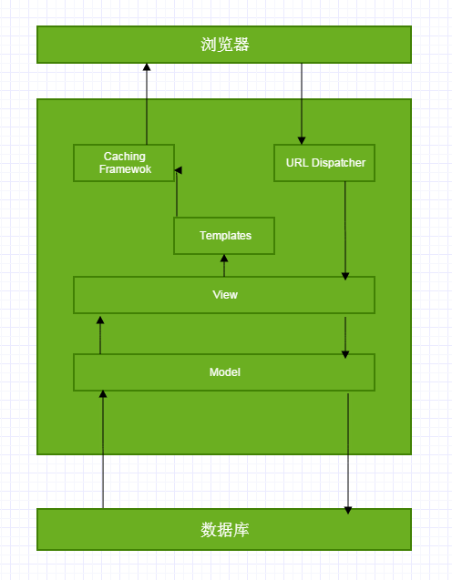

django 预研
===========

关于 django
-----------

django 概述
~~~~~~~~~~~

django 是一个开源的 Web 应用框架，由 Python
编写。它最初是被用于管理劳伦斯出版集团旗下的一些以新闻内容为主的网站。

django
负责处理网站开发中麻烦的部分，使得开发人员可以专注于编写应用程序。

django 框架
~~~~~~~~~~~

django 采用了 MTV 的框架模式。

============= ====================================================== ===============
层次          功能                                                   对应文档
============= ====================================================== ===============
模型 Model    数据库接口。定义数据模型。Python 类，不用写 SQL 语句。 models.py
视图 View     处理请求和查询数据。                                   views.py
模版 Template 呈现数据，使用带基本逻辑声明的模板语言。               template/*.html
============= ====================================================== ===============

django 处理流程
^^^^^^^^^^^^^^^

   django 处理流程

-  urls.py：URL 调度器。根据请求 URL 将 HTTP
   请求重定向到对应的视图。还可使用正则表达式捕获特定模式，作为数据参数传递给视图。
-  views.py：视图。一个请求处理函数，接收 HTTP 请求并返回 HTTP
   响应。视图通过模型访问所需的数据，并依赖模板完成响应格式。
-  models.py：模型。用 Python
   类定义数据结构，并提供在数据管理和查询记录的功能。
-  filename.html：模板文件。指定输出文档的结构，使用占位符填写生成页面时的实际内容。通常用于创建
   HTML 或其他类型的文档。

django 其他部分
^^^^^^^^^^^^^^^

-  **表单**\ ：HTML 表单用于收集用户数据以便在服务器上进行处理。django
   简化了表单创建、验证和处理。
-  **用户身份验证和权限**\ ：django
   包含了一个用户身份验证和权限系统，该系统已经构建了安全性。
-  **缓存**\ ：
   与提供静态内容相比，动态创建内容需要更大的计算强度(也更缓慢)。django
   提供灵活的缓存，以便存储所有或部分的页面。
-  **管理网站**\ ：默认包含了一个 django
   管理站点。它十分轻松地创建了一个管理页面，使网站管理员能够创建、编辑和查看站点中的任何数据模型。
-  **序列化数据**\ ：django 可以轻松地将数据序列化，并支持 XML/JSON
   格式。这有助于创建一个 Web
   服务(指数据纯粹为其他应用程序或站点所用，并不会在自己的站点中显示)或由客户端代码处理和呈现所有数据的网站。

django 优点
~~~~~~~~~~~

完备性
^^^^^^

django
遵循“功能完备”的理念，提供开发人员可能想要“开箱即用”的几乎所有功能。因为你需要的一切都是一个“产品”的一部分，它们都可以无缝结合在一起，遵循一致性设计原则，并且具有广泛和最新的文档。

通用性
^^^^^^

django
可以(并已经)用于构建几乎任何类型的网站—从内容管理系统和维基，到社交网络和新闻网站。它可以与任何客户端框架一起工作，并且可以提供几乎任何格式(包括
HTML，Rss 源，JSON，XML等)的内容。

安全性
^^^^^^

django
帮助开发人员通过提供一个被设计为“做正确的事情”来自动保护网站的框架来避免许多常见的安全错误。例如，django
提供了一种安全的方式来管理用户账户和密码，避免了常见的错误。比如将
session 放在 cookie 中这种易受攻击的做法(取而代之的是 cookie
只包含一个密钥，实际数据存储在数据库中)或直接存储密码而不是密码哈希。

默认情况下，django 可以防范许多漏洞，包括 SQL
注入，跨站点脚本，跨站点请求伪造和点击劫持。

可扩展
^^^^^^

django 使用基于组件的“无共享”架构
(架构的每一部分独立于其他架构，因此可以根据需要进行替换或更改)。在不同部分之间有明确的分隔意味着它可以通过在任何级别添加硬件来扩展服务：缓存服务器，数据库服务器或应用程序服务器。

可维护性
^^^^^^^^

django
代码编写遵照设计原则和模式，鼓励创建可维护和可重复使用的代码。特别是它使用了不要重复自己(DRY)原则，所以没有不必要的重复，减少了代码的数量。django
还将相关功能分组到可重用的“应用程序”中，并且在较低级别将相关代码分组或模块(MTV
模式)。

灵活性
^^^^^^

django 用 Python 编写，可在许多平台上运行。

django 缺点
~~~~~~~~~~~

-  没有版本控制，文章编辑权限不方便控制
-  面向开发人员
-  是一个基础框架，使用时需要二次开发

django vs django cms
--------------------

django 是一个 web 框架，可用于制作 CMS，但本身不是一个完整的
CMS。这意味着二者具有很大的区别：

使用 django
~~~~~~~~~~~

第一次运行 django，只会得到一个“It
worked”，没有其他内容和行为。需要创建新应用、编写 Python 代码、创建 HTML
模板、定义 URL 模式、设置数据库，等一系列编程工作。

django 的默认项目可类比 Apache 和
Nginx：网站什么都没有，需要自己创建所有东西。

因为 django 的一些特性(认证、管理等)，使得开发人员可以专注于开发应用。

使用 django cms
~~~~~~~~~~~~~~~

django cms 是基于 django 开发的 CMS 建站系统。

第一次运行 django cms，可以得到一个更加友好的界面，邀请你在浏览器连接到
admin 账户，开始自定义自己的网站。

默认已经安装了所有东西，可以开始创建一个静态网站，而不用编辑或新增
Python 代码。可以使用 django cms 的 admin
账户创建页面、组织格式和页面层次、安装社区开发的插件以丰富特性。

如果你需要一个静态网站(公司网站等)或电子商务，可以使用 django cms。

关于 django cms
---------------